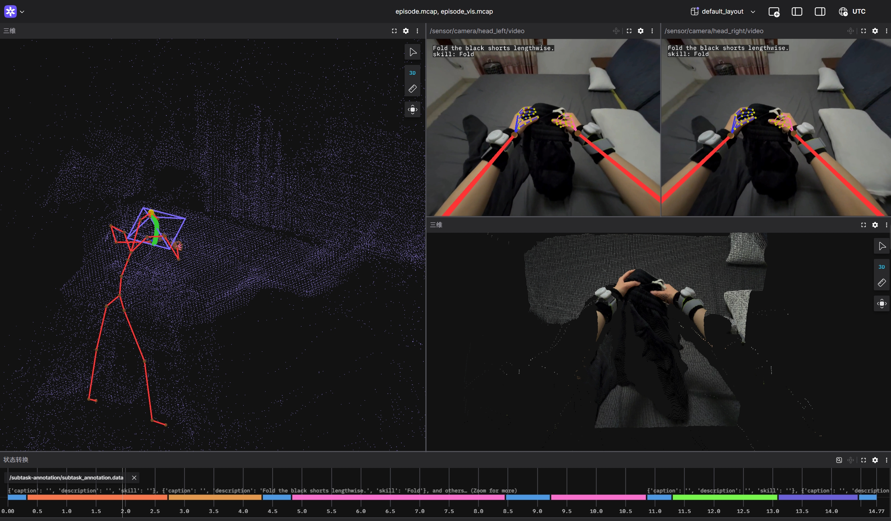

#  LW-Egosuite-DevKit

## Backend Installation

### Prerequisites

* **Operating System:** Ubuntu 20.04 or higher

### Install

```bash
cd lw_egosuite_devkit

conda create -n lwviz python=3.11
conda activate lw_egosuite_devkit
pip3 install -e .
```

## Usage

### 1. Conversion for Visualization

Generate visualization-ready MCAP files from raw egosuite MCAP data.

#### 1.1 Single File Conversion

```bash
cd lw_egosuite_devkit
mkdir output
lwviz convert --path $input_mcap_path --writer.path $mcap_for_vis_path
```

* `$input_mcap_path`: The path to the source MCAP file.
* `$mcap_for_vis_path`: (Optional) The destination path for the generated MCAP file. Default is `./output/${input_mcap_filename}_vis.mcap`.

#### 1.2 Batch Conversion

```bash
cd lw_egosuite_devkit
mkdir -p output

data_path="/path/to/your/data"

for input_mcap_path in "$data_path"/*.mcap; do
    [ -e "$input_mcap_path" ] || continue

    base_name=$(basename "$input_mcap_path" .mcap)

    mcap_for_vis_path="./output/${base_name}_vis.mcap"

    echo "Processing: $base_name ..."

    # process the file
    lwviz convert --path "$input_mcap_path" --writer.path "$mcap_for_vis_path"
done
```

* `$data_path`: The directory containing the source MCAP files. Each file will be converted and saved with a `_vis.mcap` suffix in the `./output/` directory.

### 2. Visualization with Foxglove Studio

Follow these steps to visualize the processed data in [Foxglove Studio](https://app.foxglove.dev/):

1. **Launch Foxglove**: Open the Foxglove Studio desktop application or web version.
2. **Import Layout**: Load the recommended configuration file: `assets/default_layout.json`.
3. **Load Data Streams**: Simultaneously load the source file `mcap_filename.mcap` and the generated visualization file `./output/{mcap_filename}_vis.mcap`.

Once loaded, the visualization will appear in the Foxglove Studio dashboard as shown below:



## License

This project is licensed under the [Apache License 2.0](https://www.apache.org/licenses/LICENSE-2.0).

Copyright 2026 Lightwheel Team