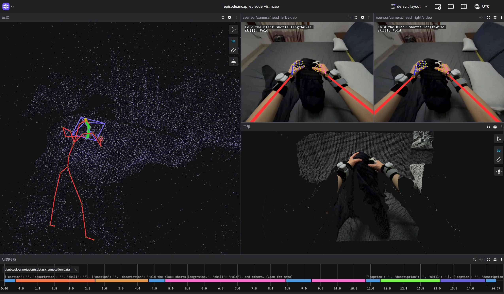

#  LW-Egosuite-DevKit

## Backend Installation

### Prerequisites

* **Operating System:** Ubuntu 20.04 or higher

### Install

**1. Conda environment**

```bash
conda create -n lw_egosuite_devkit python=3.11 -y
conda activate lw_egosuite_devkit
```

**2. Install the package**

**From PyPI:**

```bash
pip install lw-egosuite-devkit
```

**From source:**

```bash
git clone https://github.com/LightwheelAI/LW-Egosuite-DevKit.git
cd LW-Egosuite-DevKit
pip install -e .
```

## Usage

### 1. Conversion for Visualization

Generate visualization-ready MCAP files from raw egosuite MCAP data.

#### 1.1 Single File Conversion

```bash
cd LW-Egosuite-DevKit
lw-egosuite convert --mcap $input_mcap_path --mcap_vis $mcap_for_vis_path
```

| Parameter | Description |
|-----------|-------------|
| `--mcap` | Path to the source MCAP file (not a directory) |
| `--mcap_vis` | (Optional) Output path. Default: `{input_dir}/{input_stem}_vis.mcap` |

Output path is printed at the start of conversion.

#### 1.2 Batch Conversion

```bash
cd LW-Egosuite-DevKit

data_path="/path/to/your/data"

for input_mcap_path in "$data_path"/*.mcap; do
    [ -e "$input_mcap_path" ] || continue

    echo "Processing: $input_mcap_path ..."

    # output goes to same directory as input
    lw-egosuite convert --mcap "$input_mcap_path"
done
```

* `$data_path`: The directory containing the source MCAP files. Each file will be converted and saved with a `_vis.mcap` suffix in the **same directory** as the source file.

### 2. Reading from MCAP

#### 2.1 Export Video (CLI)

Export video requires **ffmpeg** on PATH. If not installed:

```bash
sudo apt install ffmpeg
```

Export a `foxglove.CompressedVideo` topic from an MCAP file to MP4. Uses stream copy (no re-encode). Output is a valid MP4 with moov atom at the start for compatibility.

```bash
lw-egosuite export-video --mcap path/to/file.mcap --output output.mp4
```

| Parameter | Description |
|-----------|-------------|
| `--mcap` | Input MCAP file path |
| `--output` | Output MP4 file path |
| `--topic` | (Optional) CompressedVideo topic to export. Default: `/sensor/camera/head_left/video` |

#### 2.2 Iterate decoded messages (Python API)

Iterate decoded proto messages with the built-in reader:

```python
from lw_egosuite_backend.mcap_reader import iter_messages

for m in iter_messages("out.mcap"):
    print(m.topic, m.log_time_ns, m.message)

# Filter by topics
for m in iter_messages("out.mcap", topics=["/pose/body"]):
    print(m.topic, m.message)
```

#### 2.3 Decoding camera video frames (Python API)

Camera streams are stored as `foxglove.CompressedVideo` messages on topics such as:

- `/sensor/camera/head_left/video`
- `/sensor/camera/head_right/video`

You can decode these into `numpy.ndarray` or `torch.Tensor` using `EgosuiteMcapReader.iter_video_frames`:

```python
from lw_egosuite_backend.mcap_reader import EgosuiteMcapReader, iter_video_frames

# Using the context-managed reader:
with EgosuiteMcapReader("episode.mcap") as r:
    for frame in r.iter_video_frames("/sensor/camera/head_left/video", output="numpy"):
        # frame is a numpy.ndarray with shape (H, W, 3), dtype=uint8
        print(frame.shape, frame.dtype)

# Using the convenience helper for a single topic:
for frame in iter_video_frames(
    "episode.mcap",
    topic="/sensor/camera/head_left/video",
    output="numpy",  # or "torch"
):
    print(frame.shape)
```

**Notes:**

- Video decoding requires **ffmpeg** and **ffprobe** on PATH.
- `numpy` is required; `torch` is only required when `output="torch"`.

### 3. Visualization with Foxglove Studio

Follow these steps to visualize the processed data in [Foxglove Studio](https://app.foxglove.dev/):

1. **Launch Foxglove**: Open the Foxglove Studio desktop application or web version.
2. **Import Layout**: Load the recommended configuration file: `assets/default_layout.json`.
3. **Load Data Streams**: Simultaneously load the source file `mcap_filename.mcap` and the generated visualization file `{mcap_filename}_vis.mcap` (in the same directory as the source by default).

Once loaded, the visualization will appear in the Foxglove Studio dashboard as shown below:



## License

This project is licensed under the [Apache License 2.0](https://www.apache.org/licenses/LICENSE-2.0).

Copyright 2026 Lightwheel Team