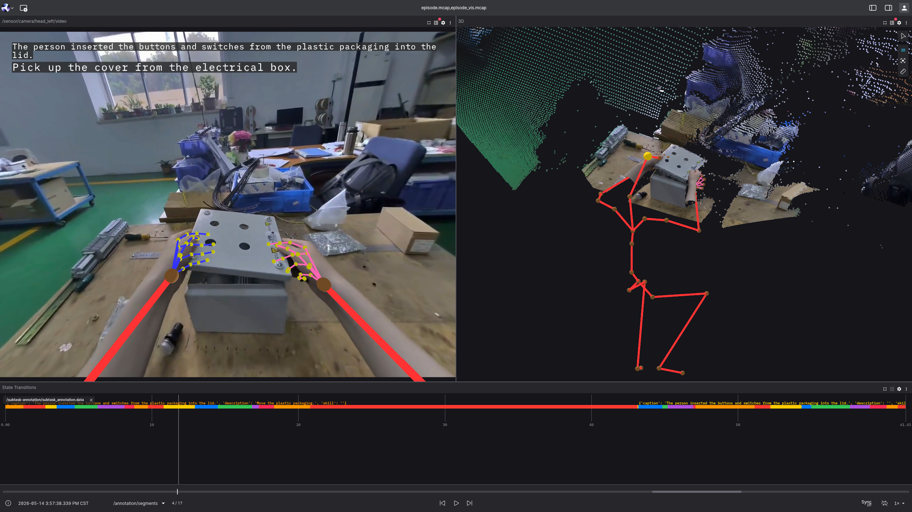

# LW-Egosuite-DevKit

## Installation

### Prerequisites

* **Operating System:** Ubuntu 20.04 or higher

### Install

**1. Conda environment**

```bash
conda create -n lw_egosuite_devkit python=3.11 -y
conda activate lw_egosuite_devkit
```

**2. Install the package**

**From PyPI:**

```bash
pip install lw-egosuite-devkit
```

**From source:**

```bash
git clone https://github.com/LightwheelAI/LW-Egosuite-DevKit.git
cd LW-Egosuite-DevKit
pip install -e .
```

## Usage

### 1. Conversion for Visualization

Generate visualization-ready MCAP files from raw egosuite MCAP data.

#### 1.1 Single File Conversion

```bash
cd LW-Egosuite-DevKit
lw-egosuite convert --mcap $input_mcap_path --mcap_vis $mcap_for_vis_path
```

| Parameter | Description |
|-----------|-------------|
| `--mcap` | Path to the source MCAP file (not a directory) |
| `--mcap_vis` | (Optional) Output path. Default: `{input_dir}/{input_stem}_vis.mcap` |

Output path is printed at the start of conversion.

#### 1.2 Batch Conversion

```bash
cd LW-Egosuite-DevKit

data_path="/path/to/your/data"

for input_mcap_path in "$data_path"/*.mcap; do
    [ -e "$input_mcap_path" ] || continue

    echo "Processing: $input_mcap_path ..."

    # output goes to same directory as input
    lw-egosuite convert --mcap "$input_mcap_path"
done
```

* `$data_path`: The directory containing the source MCAP files. Each file will be converted and saved with a `_vis.mcap` suffix in the **same directory** as the source file.

### 2. Data Visualization

Follow these steps to visualize the processed data in [LW-VIZ](https://foxviz.lightwheel.net/):

1. **Launch LW-VIZ**: Open the LW-VIZ visualization platform.
2. **Import Layout**: Select default mode in the Layouts option. Load the recommended configuration file: `assets/default_layout.json`.
3. **Load Data Streams**: Simultaneously load the source file `mcap_filename.mcap` and the generated visualization file `{mcap_filename}_vis.mcap` (in the same directory as the source by default).

Once loaded, the visualization will appear in the dashboard as shown below:



### 3. Topics

#### 3.1 Source Topics (Raw MCAP)

The following topics are expected in the raw input MCAP file. For detailed joint index conventions, refer to the [Hand Pose](https://docs.lightwheel.net/egocentric_data/mcap_data/pose/hand#joint-index-and-conventions) and [Body Pose](https://docs.lightwheel.net/egocentric_data/mcap_data/pose/body#joint-index-and-conventions) documentation. For further details on message formats and schemas, see the [MCAP Data documentation](https://docs.lightwheel.net/egocentric_data/mcap_data/overview).

<details>
<summary>Click to expand topic list of raw MCAP</summary>

| Topic | Proto Message | Description |
|-------|--------------|-------------|
| `/session/metadata`                         | `session.SessionMetadata`                     | Session-level metadata: task info, operator, episode UUID |
| `/pose/body`                                | `pose.BodyFrame`                              | Body joint positions in world frame: `/pose/body` (22-joint full-body), `/pose/upper_body` (14-joint upper-body), or `/pose/lower_body` (8-joint lower-body) |
| `/pose/head`                                | `pose.HeadFrame`                              | Head pose (position + orientation) in world frame |
| `/pose/headcam`                             | `pose.HeadCamFrame`                           | Head-mounted camera pose in world frame |
| `/pose/left_hand`                           | `pose.LeftHandFrame`                          | Left-hand 21-joint keypoints in world frame |
| `/pose/right_hand`                          | `pose.RightHandFrame`                         | Right-hand 21-joint keypoints in world frame |
| `/pose/right_eye_cam`                       | `pose.RightEyeCamFrame`                       | Right eye camera pose in world frame |
| `/annotation/semantic_segments`             | `annotation.SemanticSegment`                  | Time-segmented subtask annotations (action level) |
| `/sensor/camera/head_left/video`            | `foxglove.CompressedVideo`                    | Left head camera undistorted video stream (H.264) |
| `/sensor/camera/head_right/video`           | `foxglove.CompressedVideo`                    | Right head camera undistorted video stream (H.264) |
| `/sensor/camera/head_left/intrinsic`        | `foxglove.CameraCalibration`                  | Left head camera intrinsic calibration |
| `/sensor/camera/head_right/intrinsic`       | `foxglove.CameraCalibration`                  | Right head camera intrinsic calibration |
| `/sensor/camera/head_left/extrinsic`        | `foxglove.FrameTransforms`                    | Left head camera extrinsic (camera pose in world frame; parent=world, child=camera) |
| `/sensor/camera/head_right/extrinsic`       | `foxglove.FrameTransforms`                    | Right head camera extrinsic |
| `/sensor/camera/left_wrist/video`           | `foxglove.CompressedVideo`                    | Left wrist camera undistorted video stream (H.264) |
| `/sensor/camera/right_wrist/video`          | `foxglove.CompressedVideo`                    | Right wrist camera undistorted video stream (H.264) |
| `/sensor/camera/left_wrist/intrinsic`       | `foxglove.CameraCalibration`                  | Left wrist camera intrinsic calibration |
| `/sensor/camera/right_wrist/intrinsic`      | `foxglove.CameraCalibration`                  | Right wrist camera intrinsic calibration |
| `/sensor/camera/head_depth/image`           | `foxglove.CompressedImage`                    | Head depth camera image *(optional)* |
| `/sensor/camera/head_depth/intrinsic`       | `foxglove.CameraCalibration`                  | Head depth camera intrinsic calibration *(optional)* |
| `/sensor/camera/head_depth/extrinsic`       | `foxglove.FrameTransforms`                    | Head depth camera extrinsic *(optional)* |
| `/sensor/camera_raw/head_left/video`        | `foxglove.CompressedVideo`                    | Left head camera raw video stream *(optional)* |
| `/sensor/camera_raw/head_right/video`       | `foxglove.CompressedVideo`                    | Right head camera raw video stream *(optional)* |
| `/sensor/camera_raw/left_wrist/video`       | `foxglove.CompressedVideo`                    | Left wrist camera raw video stream *(optional)* |
| `/sensor/camera_raw/right_wrist/video`      | `foxglove.CompressedVideo`                    | Right wrist camera raw video stream *(optional)* |
| `/sensor/camera_raw/head_left/calibration`  | `sensor.camera.RawCameraCalibration`          | Left head camera raw intrinsic calibration *(optional)* |
| `/sensor/camera_raw/head_right/calibration` | `sensor.camera.RawCameraCalibration`          | Right head camera raw intrinsic calibration *(optional)* |
| `/sensor/camera_raw/left_wrist/calibration` | `sensor.camera.RawCameraCalibration`          | Left wrist camera raw intrinsic calibration *(optional)* |
| `/sensor/camera_raw/right_wrist/calibration`| `sensor.camera.RawCameraCalibration`          | Right wrist camera raw intrinsic calibration *(optional)* |
| `/annotation/bad_frame/pose/upper_body`     | `annotation.BadFrameBody`                     | Per-frame upper-body quality flag (is_bad + problem_type) *(optional)* |
| `/annotation/bad_frame/pose/lower_body`     | `annotation.BadFrameBody`                     | Per-frame lower-body quality flag *(optional)* |
| `/annotation/bad_frame/pose/hand`           | `annotation.BadFrameHand`                     | Per-frame hand quality flag *(optional)* |
| `/annotation/bad_frame/camera/head_left`    | `annotation.BadFrameImage`                    | Per-frame head-left camera quality flag *(optional)* |
| `/annotation/bad_frame/camera/left_wrist`   | `annotation.BadFrameImage`                    | Per-frame left-wrist camera quality flag *(optional)* |
| `/annotation/bad_frame/camera/right_wrist`  | `annotation.BadFrameImage`                    | Per-frame right-wrist camera quality flag *(optional)* |
| `/sensor/audio`                             | `foxglove.RawAudio`                           | Raw audio stream (PCM s16) *(optional)* |

</details>

#### 3.2 Output Topics (Visualization MCAP)

The following topics are written into the `_vis.mcap` file by the conversion pipeline:

| Topic | Message Type | Description |
|-------|-------------|-------------|
| `/tf-tree/tf_tree`                                  | `foxglove.FrameTransforms`     | Coordinate frame transforms for the TF tree |
| `/scene-update/upper_body_keypoints`                | `foxglove.SceneUpdate`         | Upper-body skeleton (spine + arms) rendered as spheres + lines |
| `/scene-update/lower_body_keypoints`                | `foxglove.SceneUpdate`         | Lower-body skeleton (hips + legs) rendered as spheres + lines *(only when lower-body joints are present)* |
| `/scene-update/right_hand_keypoints`                | `foxglove.SceneUpdate`         | Right-hand 3D skeleton (21 joints + finger bones) |
| `/scene-update/left_hand_keypoints`                 | `foxglove.SceneUpdate`         | Left-hand 3D skeleton (21 joints + finger bones) |
| `/scene-update/right_hand_keypoints_2d`             | `foxglove.SceneUpdate`         | Right-hand skeleton projected for 2D overlay view |
| `/scene-update/left_hand_keypoints_2d`              | `foxglove.SceneUpdate`         | Left-hand skeleton projected for 2D overlay view |
| `/scene-update/head_trajectory`                     | `foxglove.SceneUpdate`         | Head movement trajectory (jet colormap dots, last 300 frames) |
| `/scene-update/foot_trajectory`                     | `foxglove.SceneUpdate`         | Foot movement trajectory: left and right foot (jet colormap dots, last 100 frames) *(only with lower-body data)* |
| `/state-transitions/subtask_description`            | `foxglove.Log`                 | Subtask description text; skill appended when present |
| `/image-annotations/semantic_segments`              | `foxglove.ImageAnnotations`    | Subtask annotation text overlaid on the camera image |

### 4. Reading from MCAP

#### 4.1 Export Video (CLI)

Export video requires **ffmpeg** on PATH. If not installed:

```bash
sudo apt install ffmpeg
```

Export a `foxglove.CompressedVideo` topic from an MCAP file to MP4. Uses stream copy (no re-encode). Output is a valid MP4 with moov atom at the start for compatibility.

```bash
lw-egosuite export-video --mcap path/to/file.mcap --output output.mp4
```

| Parameter | Description |
|-----------|-------------|
| `--mcap` | Input MCAP file path |
| `--output` | Output MP4 file path |
| `--topic` | (Optional) CompressedVideo topic to export. Default: `/sensor/camera/head_left/video` |

#### 4.2 Iterate decoded messages (Python API)

Iterate decoded proto messages with the built-in reader:

```python
from lw_egosuite_backend.mcap_reader import iter_messages

for m in iter_messages("out.mcap"):
    print(m.topic, m.log_time_ns, m.message)

# Filter by topics
for m in iter_messages("out.mcap", topics=["/pose/body"]):
    print(m.topic, m.message)
```

#### 4.3 Decoding camera video frames (Python API)

Camera streams are stored as `foxglove.CompressedVideo` messages on topics such as:

- `/sensor/camera/head_left/video`
- `/sensor/camera/head_right/video`

You can decode these into `numpy.ndarray` or `torch.Tensor` using `EgosuiteMcapReader.iter_video_frames`:

```python
from lw_egosuite_backend.mcap_reader import EgosuiteMcapReader, iter_video_frames

# Using the context-managed reader:
with EgosuiteMcapReader("episode.mcap") as r:
    for frame in r.iter_video_frames("/sensor/camera/head_left/video", output="numpy"):
        # frame is a numpy.ndarray with shape (H, W, 3), dtype=uint8
        print(frame.shape, frame.dtype)

# Using the convenience helper for a single topic:
for frame in iter_video_frames(
    "episode.mcap",
    topic="/sensor/camera/head_left/video",
    output="numpy",  # or "torch"
):
    print(frame.shape)
```

**Notes:**

- Video decoding requires **ffmpeg** and **ffprobe** on PATH.
- `numpy` is required; `torch` is only required when `output="torch"`.

## License

This project is licensed under the [Apache License 2.0](https://www.apache.org/licenses/LICENSE-2.0).

Copyright 2026 Lightwheel Team
